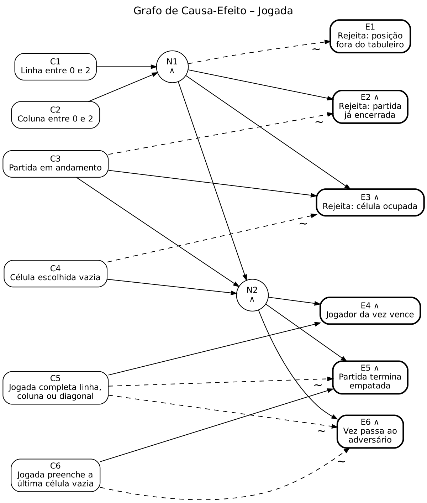

# Parte I – Teste Funcional: Jogo da Velha

DCC168 Teste de Software – 2026-3 · Entrega: 13/10/2026

Este documento especifica o conjunto de teste funcional **TestSet-Func** a partir da
especificação do Jogo da Velha, aplicando os três critérios pedidos no enunciado:

1. Particionamento em Classes de Equivalência (seção 3);
2. Análise do Valor Limite (seção 4);
3. Grafo de Causa-Efeito (seção 5).

Os casos de teste resultantes estão na Tabela 2 (seção 6). A rastreabilidade entre classes,
valores limite, regras do grafo e casos de teste está na seção 7.

---

## 1. Especificação do programa

> O Jogo da Velha é disputado entre dois jogadores, representados pelos símbolos "X" e "O",
> cujo objetivo é ser o primeiro a formar uma linha com três símbolos iguais, seja na
> horizontal, vertical ou diagonal, em uma matriz 3 x 3. Os jogadores se alternam para
> preencher as células da matriz com os símbolos "X" e "O" respectivamente. O jogo termina
> em empate se todas as células da matriz forem preenchidas sem um vencedor.

## 2. Decisões do grupo sobre pontos que a especificação deixa em aberto

A especificação não define o comportamento em vários casos. As decisões abaixo fazem parte do
oráculo de teste: são elas que determinam a saída esperada de cada caso.

| # | Ponto em aberto | Decisão | Justificativa |
|---|---|---|---|
| D1 | Quem começa | X sempre faz a primeira jogada | "X e O respectivamente" |
| D2 | Numeração das células | Linha e coluna de 0 a 2 | Convenção de matriz em Java |
| D3 | Formato da entrada | Uma linha de texto com dois inteiros separados por espaço: `linha coluna` (ex.: `1 2`) | Interface de console |
| D4 | Entrada mal formatada | Rejeitada com a mensagem `Jogada inválida: <motivo>`; o tabuleiro não muda e a vez não passa | Jogada inválida não pode custar a vez |
| D5 | Posição fora do tabuleiro | Rejeitada (`POSITION_OUT_OF_BOUNDS`); tabuleiro e vez inalterados | Idem D4 |
| D6 | Célula já ocupada | Rejeitada (`CELL_OCCUPIED`); tabuleiro e vez inalterados | Idem D4 |
| D7 | Jogada após o fim da partida | Rejeitada (`GAME_ALREADY_FINISHED`); resultado inalterado | A partida encerrada não pode mudar de resultado |
| D8 | Ordem das verificações de uma jogada | 1º posição dentro do tabuleiro, 2º partida em andamento, 3º célula vazia | Define a saída quando há mais de um problema ao mesmo tempo |
| D9 | Vitória na 9ª jogada | É vitória, não empate: a vitória é verificada antes do empate | O jogador completou uma linha; o empate exige "sem um vencedor" |
| D10 | Fim da partida | Ao vencer ou empatar, o programa mostra `X venceu!`, `O venceu!` ou `Empate!` e encerra | – |

### Notação usada nos casos de teste

- Uma jogada é escrita como `(linha,coluna)`. Exemplo: `(0,2)` é a linha 0, coluna 2.
- Uma partida é a sequência de jogadas digitadas, alternando X e O a partir de X:
  `<X(0,0), O(1,0), X(0,1)>`.
- Quando o caso testa o formato da entrada, a entrada é o texto digitado, entre aspas:
  `<"a 1">`.
- A saída esperada informa o **estado da partida** (`IN_PROGRESS`, `X_WINS`, `O_WINS`,
  `DRAW`), o **jogador da vez** ao final e, para jogadas rejeitadas, o **motivo da rejeição**
  ou a mensagem exibida.

---

## 3. Particionamento em Classes de Equivalência

### 3.1 Condições de entrada

| Condição | O que é avaliado |
|---|---|
| Formato da entrada | Texto digitado para uma jogada |
| Linha | Primeiro valor da jogada |
| Coluna | Segundo valor da jogada |
| Célula escolhida | Situação da célula no momento da jogada |
| Estado da partida | Situação da partida no momento da jogada |
| Resultado da jogada válida | O que a jogada aceita provoca no tabuleiro |
| Jogador que completa a linha | Quem forma a linha vencedora |

As duas últimas condições são **classes de saída**: particionam o domínio pelas saídas
distintas que o programa deve produzir, para garantir que cada forma de vitória e o empate
sejam exercitados.

### 3.2 Tabela 1 – Classes de Equivalência

| Condição de Entrada | Classes de Equivalência Válidas | Classes de Equivalência Inválidas |
|---|---|---|
| Formato da entrada | dois inteiros separados por espaço (V1) | quantidade de valores ≠ 2 (I1) e valor não inteiro (I2) |
| Linha (L) | 0 ≤ L ≤ 2 (V2) | L < 0 (I3) e L > 2 (I4) |
| Coluna (C) | 0 ≤ C ≤ 2 (V3) | C < 0 (I5) e C > 2 (I6) |
| Célula escolhida | vazia (V4) | ocupada (I7) |
| Estado da partida | em andamento (V5) | encerrada – vitória ou empate (I8) |
| Resultado da jogada válida | completa linha horizontal (V6), completa coluna (V7), completa diagonal principal (V8), completa diagonal secundária (V9), preenche a última célula sem formar linha – empate (V10) e não completa linha nem preenche o tabuleiro – partida continua (V11) | – |
| Jogador que completa a linha | X (V12) e O (V13) | – |

---

## 4. Análise do Valor Limite

| Variável | Limite | Valores testados | Caso de teste |
|---|---|---|---|
| Linha | inferior | −1 (inválido) · 0 (válido) | CT09 · CT08 |
| Linha | superior | 2 (válido) · 3 (inválido) | CT08 · CT10 |
| Coluna | inferior | −1 (inválido) · 0 (válido) | CT11 · CT08 |
| Coluna | superior | 2 (válido) · 3 (inválido) | CT08 · CT12 |
| Quantidade de valores na entrada | 2 | 0 · 1 (inválidos) · 2 (válido) · 3 (inválido) | CT20 · CT18 · CT21 · CT19 |
| Número da jogada | início da partida | 1ª jogada é de X | CT07 |
| Número da jogada | menor vitória possível de X | vitória na 5ª jogada | CT01 |
| Número da jogada | menor vitória possível de O | vitória na 6ª jogada | CT02 |
| Número da jogada | tabuleiro cheio | 9ª jogada com empate · 9ª jogada com vitória | CT05 · CT06 |
| Número da jogada | após o fim | jogada seguinte à vitória · seguinte ao empate (10ª) | CT14 · CT15 |

O par CT05/CT06 é o limite mais importante do jogo: as duas partidas preenchem as nove
células, mas uma termina em empate e a outra em vitória (decisão D9). Uma implementação que
verifique "tabuleiro cheio" antes de "linha completa" passa no CT05 e falha no CT06.

---

## 5. Grafo de Causa-Efeito

O grafo modela uma jogada já convertida em linha e coluna. O formato do texto digitado
(classes V1, I1 e I2) fica fora do grafo, porque é tratado antes, pela leitura da entrada.

### 5.1 Causas

| ID | Causa |
|---|---|
| C1 | Linha entre 0 e 2 |
| C2 | Coluna entre 0 e 2 |
| C3 | Partida em andamento |
| C4 | Célula escolhida vazia |
| C5 | Jogada completa linha, coluna ou diagonal |
| C6 | Jogada preenche a última célula vazia |

### 5.2 Efeitos

| ID | Efeito |
|---|---|
| E1 | Rejeita a jogada: posição fora do tabuleiro |
| E2 | Rejeita a jogada: partida já encerrada |
| E3 | Rejeita a jogada: célula ocupada |
| E4 | Jogador da vez vence |
| E5 | Partida termina empatada |
| E6 | Vez passa ao adversário |

### 5.3 Relações

Nós intermediários:

- N1 = C1 ∧ C2 (posição válida)
- N2 = N1 ∧ C3 ∧ C4 (jogada aceita)

Efeitos:

- E1 = ¬N1
- E2 = N1 ∧ ¬C3
- E3 = N1 ∧ C3 ∧ ¬C4
- E4 = N2 ∧ C5
- E5 = N2 ∧ ¬C5 ∧ C6
- E6 = N2 ∧ ¬C5 ∧ ¬C6

A estrutura reflete a ordem das verificações (D8): E2 só ocorre com posição válida e E3 só
ocorre com posição válida e partida em andamento. E4 não depende de C6, e E5 exige ¬C5: é a
decisão D9 escrita no grafo.

Os efeitos são mutuamente exclusivos: para qualquer combinação de causas, exatamente um
efeito ocorre.

### 5.4 Grafo

No desenho, ∧ dentro do nó indica a porta E, e a aresta tracejada com `~` indica negação.

### 5.5 Tabela de Decisão

Cada coluna é uma regra (R1 a R7). `V` = verdadeiro, `F` = falso, `–` = o valor da causa não
altera o efeito naquela regra, `X` = efeito produzido.

| Causa / Efeito | R1 | R2 | R3 | R4 | R5 | R6 | R7 |
|---|---|---|---|---|---|---|---|
| C1 – Linha entre 0 e 2 | – | F | V | V | V | V | V |
| C2 – Coluna entre 0 e 2 | F | V | V | V | V | V | V |
| C3 – Partida em andamento | – | – | F | V | V | V | V |
| C4 – Célula escolhida vazia | – | – | – | F | V | V | V |
| C5 – Jogada completa linha, coluna ou diagonal | – | – | – | – | V | F | F |
| C6 – Jogada preenche a última célula vazia | – | – | – | – | – | V | F |
| E1 – Rejeita: posição fora do tabuleiro | X | X | | | | | |
| E2 – Rejeita: partida já encerrada | | | X | | | | |
| E3 – Rejeita: célula ocupada | | | | X | | | |
| E4 – Jogador da vez vence | | | | | X | | |
| E5 – Partida termina empatada | | | | | | X | |
| E6 – Vez passa ao adversário | | | | | | | X |

Cada regra é coberta por pelo menos um caso de teste (seção 7.3). Para as regras com `–`,
foram incluídos casos que fixam a causa livre em valores diferentes quando isso testa uma
decisão do grupo:

- **R1 com C3 = F (CT16):** posição inválida com a partida encerrada. Deve prevalecer a
  rejeição por posição (D8).
- **R3 com C4 = F (CT15):** jogada após o empate em célula ocupada. Deve prevalecer a
  rejeição por partida encerrada (D8).
- **R5 com C6 = V (CT06):** vitória com a última célula. Deve ser vitória, não empate (D9).

---

## 6. Tabela 2 – Casos de Teste (TestSet-Func)

A coluna **Saída Obtida** é preenchida na execução dos testes (Parte II-A).

| ID | Condições de Entrada | Saída Esp. | Classes Eq. Exercitadas | Saída Obtida |
|---|---|---|---|---|
| CT01 | <X(0,0), O(1,0), X(0,1), O(1,1), X(0,2)> | X_WINS (linha 0); mensagem "X venceu!" | V1, V2, V3, V4, V5, V6, V12 | |
| CT02 | <X(0,0), O(0,2), X(1,0), O(1,2), X(2,1), O(2,2)> | O_WINS (coluna 2); mensagem "O venceu!" | V1, V2, V3, V4, V5, V7, V13 | |
| CT03 | <X(0,0), O(0,1), X(1,1), O(0,2), X(2,2)> | X_WINS (diagonal principal) | V1, V2, V3, V4, V5, V8, V12 | |
| CT04 | <X(0,2), O(0,0), X(1,1), O(0,1), X(2,0)> | X_WINS (diagonal secundária) | V1, V2, V3, V4, V5, V9, V12 | |
| CT05 | <X(0,0), O(0,1), X(0,2), O(1,1), X(1,0), O(2,0), X(2,1), O(1,2), X(2,2)> | DRAW; mensagem "Empate!" | V1, V2, V3, V4, V5, V10 | |
| CT06 | <X(0,2), O(0,1), X(1,1), O(2,0), X(2,1), O(1,0), X(0,0), O(1,2), X(2,2)> | X_WINS (diagonal principal na 9ª jogada), não DRAW | V1, V2, V3, V4, V5, V8, V12 | |
| CT07 | <X(1,1)> | IN_PROGRESS; X jogou primeiro; vez de O | V1, V2, V3, V4, V5, V11 | |
| CT08 | <X(0,0), O(0,2), X(2,0), O(2,2)> | IN_PROGRESS; as 4 jogadas aceitas; vez de X | V1, V2, V3, V4, V5, V11 | |
| CT09 | <X(−1,0)> | Rejeitada: POSITION_OUT_OF_BOUNDS; tabuleiro vazio; vez de X | V1, I3, V3 | |
| CT10 | <X(3,0)> | Rejeitada: POSITION_OUT_OF_BOUNDS; tabuleiro vazio; vez de X | V1, I4, V3 | |
| CT11 | <X(0,−1)> | Rejeitada: POSITION_OUT_OF_BOUNDS; tabuleiro vazio; vez de X | V1, V2, I5 | |
| CT12 | <X(0,3)> | Rejeitada: POSITION_OUT_OF_BOUNDS; tabuleiro vazio; vez de X | V1, V2, I6 | |
| CT13 | <X(0,0), O(0,0)> | 2ª jogada rejeitada: CELL_OCCUPIED; célula (0,0) continua com X; vez de O | V1, V2, V3, I7, V5 | |
| CT14 | jogadas do CT01 + <O(2,2)> | Rejeitada: GAME_ALREADY_FINISHED; resultado continua X_WINS | V1, V2, V3, V4, I8 | |
| CT15 | jogadas do CT05 + <X(0,0)> | Rejeitada: GAME_ALREADY_FINISHED (não CELL_OCCUPIED); resultado continua DRAW | V1, V2, V3, I7, I8 | |
| CT16 | jogadas do CT01 + <O(3,3)> | Rejeitada: POSITION_OUT_OF_BOUNDS (não GAME_ALREADY_FINISHED); resultado continua X_WINS | V1, I4, I6, I8 | |
| CT17 | <"a 1"> | Mensagem "Jogada inválida: 'a' não é um número"; tabuleiro vazio; vez de X | I2 | |
| CT18 | <"1"> | Mensagem "Jogada inválida: informe exatamente dois números"; tabuleiro vazio; vez de X | I1 | |
| CT19 | <"1 1 1"> | Mensagem "Jogada inválida: informe exatamente dois números"; tabuleiro vazio; vez de X | I1 | |
| CT20 | <""> (linha vazia) | Mensagem "Jogada inválida: informe exatamente dois números"; tabuleiro vazio; vez de X | I1 | |
| CT21 | <"  1   1  "> (espaços extras) | Jogada aceita em (1,1); IN_PROGRESS; vez de O | V1, V2, V3, V4, V5, V11 | |

**Sobre os casos com mais de uma classe inválida:** pela técnica, cada caso deve exercitar
uma única classe inválida, para que a causa de uma falha seja identificável. CT15 e CT16 são
exceções intencionais: vêm do grafo de causa-efeito e testam qual rejeição prevalece quando
há dois problemas ao mesmo tempo (D8). As classes inválidas desses casos já são cobertas
isoladamente: I4 e I6 no CT10 e no CT12, I7 no CT13 e I8 no CT14.

---

## 7. Rastreabilidade

### 7.1 Classes de equivalência → casos de teste

| Classe | Descrição | Casos de teste |
|---|---|---|
| V1 | dois inteiros separados por espaço | todos exceto CT17–CT20 |
| I1 | quantidade de valores ≠ 2 | CT18, CT19, CT20 |
| I2 | valor não inteiro | CT17 |
| V2 | 0 ≤ L ≤ 2 | CT01–CT08, CT11–CT15, CT21 |
| I3 | L < 0 | CT09 |
| I4 | L > 2 | CT10, CT16 |
| V3 | 0 ≤ C ≤ 2 | CT01–CT10, CT13–CT15, CT21 |
| I5 | C < 0 | CT11 |
| I6 | C > 2 | CT12, CT16 |
| V4 | célula vazia | CT01–CT08, CT14, CT21 |
| I7 | célula ocupada | CT13, CT15 |
| V5 | partida em andamento | CT01–CT08, CT13, CT21 |
| I8 | partida encerrada | CT14, CT15, CT16 |
| V6 | completa linha horizontal | CT01 |
| V7 | completa coluna | CT02 |
| V8 | completa diagonal principal | CT03, CT06 |
| V9 | completa diagonal secundária | CT04 |
| V10 | empate | CT05 |
| V11 | partida continua | CT07, CT08, CT21 |
| V12 | X completa a linha | CT01, CT03, CT04, CT06 |
| V13 | O completa a linha | CT02 |

Todas as 21 classes (13 válidas e 8 inválidas) são exercitadas por pelo menos um caso de
teste.

### 7.2 Valores limite → casos de teste

Ver a coluna "Caso de teste" da seção 4. Todos os limites identificados têm caso de teste.

### 7.3 Regras da tabela de decisão → casos de teste

| Regra | Efeito | Casos de teste |
|---|---|---|
| R1 | E1 – coluna fora do tabuleiro | CT11, CT12, CT16 |
| R2 | E1 – linha fora do tabuleiro (coluna válida) | CT09, CT10 |
| R3 | E2 – partida já encerrada | CT14, CT15 |
| R4 | E3 – célula ocupada | CT13 |
| R5 | E4 – jogador da vez vence | CT01, CT02, CT03, CT04, CT06 |
| R6 | E5 – empate | CT05 |
| R7 | E6 – vez passa ao adversário | CT07, CT08, CT21 |

### 7.4 Nível de execução de cada caso

| Casos | Onde rodam (Parte II) | Por quê |
|---|---|---|
| CT03, CT04, CT06–CT16 | Regras do jogo, chamando as jogadas diretamente | Testam o comportamento da partida |
| CT01, CT02, CT05 | Console, com entrada simulada | A saída esperada inclui a mensagem final ("X venceu!", "O venceu!", "Empate!") |
| CT17–CT21 | Console, com entrada simulada | Testam a leitura do texto digitado, que só existe no console |

---

## 8. Resumo

| Item | Quantidade |
|---|---|
| Decisões sobre pontos em aberto | 10 |
| Classes de equivalência | 21 (13 válidas, 8 inválidas) |
| Limites analisados | 10 |
| Causas / efeitos / regras do grafo | 6 / 6 / 7 |
| Casos de teste (TestSet-Func) | 21 |
