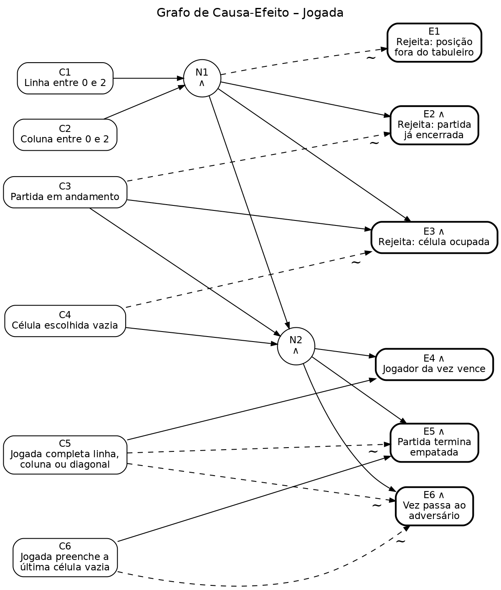

# Artefatos gerados para o relatório

**Tabela 1 – Classes de Equivalência**

| Condição de Entrada | Classes de Equivalência Válidas | Classes de Equivalência Inválidas |
|---|---|---|
| Formato da entrada | dois inteiros separados por espaço (V1) | quantidade de valores ≠ 2 (I1) e valor não inteiro (I2) |
| Linha (L) | 0 ≤ L ≤ 2 (V2) | L \< 0 (I3) e L > 2 (I4) |
| Coluna (C) | 0 ≤ C ≤ 2 (V3) | C \< 0 (I5) e C > 2 (I6) |
| Célula escolhida | vazia (V4) | ocupada (I7) |
| Estado da partida | em andamento (V5) | encerrada – vitória ou empate (I8) |
| Resultado da jogada válida | completa linha horizontal (V6), completa coluna (V7), completa diagonal principal (V8), completa diagonal secundária (V9), preenche a última célula sem formar linha – empate (V10) e não completa linha nem preenche o tabuleiro – partida continua (V11) | – |
| Jogador que completa a linha | X (V12) e O (V13) | – |

**Grafo de Causa-Efeito**

**Tabela de Decisão – Grafo de Causa-Efeito**

| Causa / Efeito | R1 | R2 | R3 | R4 | R5 | R6 | R7 |
|---|---|---|---|---|---|---|---|
| C1 – Linha entre 0 e 2 | – | F | V | V | V | V | V |
| C2 – Coluna entre 0 e 2 | F | V | V | V | V | V | V |
| C3 – Partida em andamento | – | – | F | V | V | V | V |
| C4 – Célula escolhida vazia | – | – | – | F | V | V | V |
| C5 – Jogada completa linha, coluna ou diagonal | – | – | – | – | V | F | F |
| C6 – Jogada preenche a última célula vazia | – | – | – | – | – | V | F |
| E1 – Rejeita: posição fora do tabuleiro | X | X |  |  |  |  |  |
| E2 – Rejeita: partida já encerrada |  |  | X |  |  |  |  |
| E3 – Rejeita: célula ocupada |  |  |  | X |  |  |  |
| E4 – Jogador da vez vence |  |  |  |  | X |  |  |
| E5 – Partida termina empatada |  |  |  |  |  | X |  |
| E6 – Vez passa ao adversário |  |  |  |  |  |  | X |

**Tabela 2 – Casos de Teste (TestSet-Func)**

| ID | Condições de Entrada | Saída Esp. | Classes Eq. Exercitadas | Saída Obtida |
|---|---|---|---|---|
| CT01 | \<X(0,0), O(1,0), X(0,1), O(1,1), X(0,2)> | X_WINS (linha 0); mensagem "X venceu!" | V1, V2, V3, V4, V5, V6, V12 | X_WINS (linha 0); mensagem "X venceu!" |
| CT02 | \<X(0,0), O(0,2), X(1,0), O(1,2), X(2,1), O(2,2)> | O_WINS (coluna 2); mensagem "O venceu!" | V1, V2, V3, V4, V5, V7, V13 | O_WINS (coluna 2); mensagem "O venceu!" |
| CT03 | \<X(0,0), O(0,1), X(1,1), O(0,2), X(2,2)> | X_WINS (diagonal principal) | V1, V2, V3, V4, V5, V8, V12 | X_WINS (diagonal principal) |
| CT04 | \<X(0,2), O(0,0), X(1,1), O(0,1), X(2,0)> | X_WINS (diagonal secundária) | V1, V2, V3, V4, V5, V9, V12 | X_WINS (diagonal secundária) |
| CT05 | \<X(0,0), O(0,1), X(0,2), O(1,1), X(1,0), O(2,0), X(2,1), O(1,2), X(2,2)> | DRAW; mensagem "Empate!" | V1, V2, V3, V4, V5, V10 | DRAW; mensagem "Empate!" |
| CT06 | \<X(0,2), O(0,1), X(1,1), O(2,0), X(2,1), O(1,0), X(0,0), O(1,2), X(2,2)> | X_WINS (diagonal principal na 9ª jogada), não DRAW | V1, V2, V3, V4, V5, V8, V12 | X_WINS (diagonal principal na 9ª jogada), não DRAW |
| CT07 | \<X(1,1)> | IN_PROGRESS; X jogou primeiro; vez de O | V1, V2, V3, V4, V5, V11 | IN_PROGRESS; X jogou primeiro; vez de O |
| CT08 | \<X(0,0), O(0,2), X(2,0), O(2,2)> | IN_PROGRESS; as 4 jogadas aceitas; vez de X | V1, V2, V3, V4, V5, V11 | IN_PROGRESS; as 4 jogadas aceitas; vez de X |
| CT09 | \<X(−1,0)> | Rejeitada: POSITION_OUT_OF_BOUNDS; tabuleiro vazio; vez de X | V1, I3, V3 | Rejeitada: POSITION_OUT_OF_BOUNDS; tabuleiro vazio; vez de X |
| CT10 | \<X(3,0)> | Rejeitada: POSITION_OUT_OF_BOUNDS; tabuleiro vazio; vez de X | V1, I4, V3 | Rejeitada: POSITION_OUT_OF_BOUNDS; tabuleiro vazio; vez de X |
| CT11 | \<X(0,−1)> | Rejeitada: POSITION_OUT_OF_BOUNDS; tabuleiro vazio; vez de X | V1, V2, I5 | Rejeitada: POSITION_OUT_OF_BOUNDS; tabuleiro vazio; vez de X |
| CT12 | \<X(0,3)> | Rejeitada: POSITION_OUT_OF_BOUNDS; tabuleiro vazio; vez de X | V1, V2, I6 | Rejeitada: POSITION_OUT_OF_BOUNDS; tabuleiro vazio; vez de X |
| CT13 | \<X(0,0), O(0,0)> | 2ª jogada rejeitada: CELL_OCCUPIED; célula (0,0) continua com X; vez de O | V1, V2, V3, I7, V5 | 2ª jogada rejeitada: CELL_OCCUPIED; célula (0,0) continua com X; vez de O |
| CT14 | jogadas do CT01 + \<O(2,2)> | Rejeitada: GAME_ALREADY_FINISHED; resultado continua X_WINS | V1, V2, V3, V4, I8 | Rejeitada: GAME_ALREADY_FINISHED; resultado continua X_WINS |
| CT15 | jogadas do CT05 + \<X(0,0)> | Rejeitada: GAME_ALREADY_FINISHED (não CELL_OCCUPIED); resultado continua DRAW | V1, V2, V3, I7, I8 | Rejeitada: GAME_ALREADY_FINISHED (não CELL_OCCUPIED); resultado continua DRAW |
| CT16 | jogadas do CT01 + \<O(3,3)> | Rejeitada: POSITION_OUT_OF_BOUNDS (não GAME_ALREADY_FINISHED); resultado continua X_WINS | V1, I4, I6, I8 | Rejeitada: POSITION_OUT_OF_BOUNDS (não GAME_ALREADY_FINISHED); resultado continua X_WINS |
| CT17 | \<"a 1"> | Mensagem "Jogada inválida: 'a' não é um número"; tabuleiro vazio; vez de X | I2 | Mensagem "Jogada inválida: 'a' não é um número"; tabuleiro vazio; vez de X |
| CT18 | \<"1"> | Mensagem "Jogada inválida: informe exatamente dois números"; tabuleiro vazio; vez de X | I1 | Mensagem "Jogada inválida: informe exatamente dois números"; tabuleiro vazio; vez de X |
| CT19 | \<"1 1 1"> | Mensagem "Jogada inválida: informe exatamente dois números"; tabuleiro vazio; vez de X | I1 | Mensagem "Jogada inválida: informe exatamente dois números"; tabuleiro vazio; vez de X |
| CT20 | \<""> (linha vazia) | Mensagem "Jogada inválida: informe exatamente dois números"; tabuleiro vazio; vez de X | I1 | Mensagem "Jogada inválida: informe exatamente dois números"; tabuleiro vazio; vez de X |
| CT21 | \<"  1   1  "> (espaços extras) | Jogada aceita em (1,1); IN_PROGRESS; vez de O | V1, V2, V3, V4, V5, V11 | Jogada aceita em (1,1); IN_PROGRESS; vez de O |

